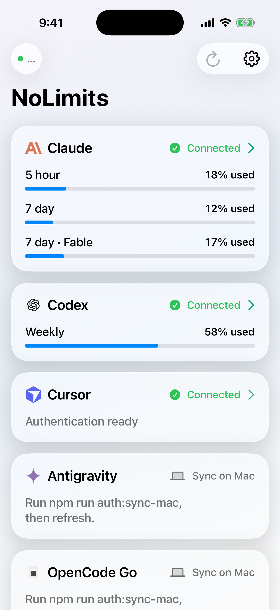
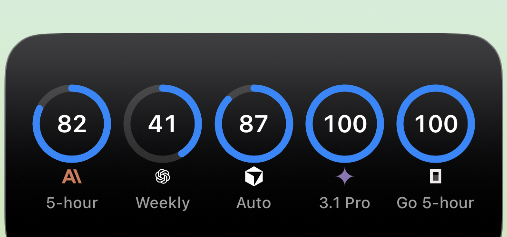

# NoLimits

NoLimits is a private SwiftUI usage dashboard for Claude, Codex, Cursor,
Antigravity, and OpenCode Go. It includes real WidgetKit widgets for the Home
Screen and Lock Screen.

**[View the live website](https://nolimits-murex.vercel.app)**

<p align="center">
  
</p>

<p align="center">
  
</p>

These are direct iOS Simulator and WidgetKit captures, not generated phone mockups.

## How it works

1. `npm run auth:sync-mac` reads the provider sessions already present on your Mac.
2. The sync writes refresh material to your private Upstash Redis instance.
3. The Railway service refreshes provider sessions and normalizes usage windows.
4. The iPhone app reads those snapshots and shares them with WidgetKit.

Provider credentials never need to be installed on the iPhone and are not
included in the app or this repository.

## Server

```sh
cp env.example .env
npm install
npm run typecheck
npm run build
npm run auth:sync-mac
railway up
```

Set the same environment variables in Railway. Keep `.env` local.

## iOS

```sh
cd ios
xcodegen generate --spec project.yml
open NoLimits.xcodeproj
```

Select your signing team and iPhone, then run the `NoLimits` scheme. The app and
widget extension use the `group.com.tarive.nolimits` App Group.

## Included

- SwiftUI dashboard and provider detail views
- Home Screen overview and provider widgets
- Inline, circular, and rectangular Lock Screen widgets
- Railway server and Upstash credential storage
- Mac authentication sync for Codex, Cursor, Antigravity, and OpenCode Go

No App Store upload is performed by this repository.
